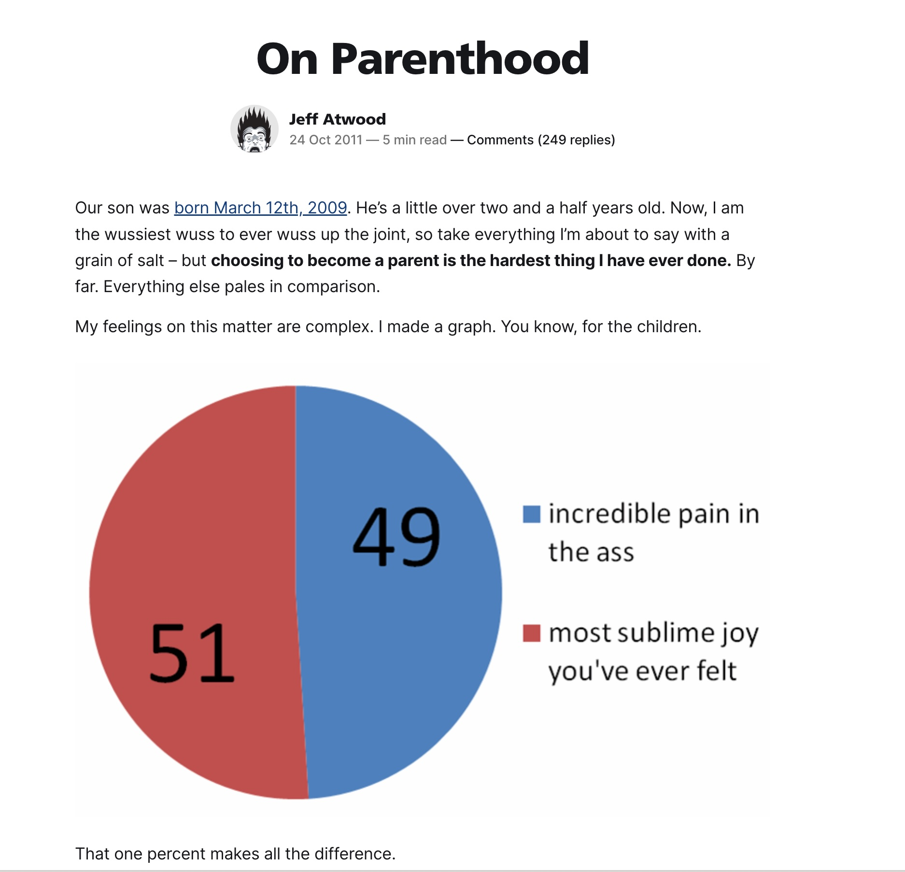

<style>
@import-theme 'base';

:root {
  font-family: "Helvetica Neue";
  background: black;
}

:root p {
  font-size: 25px;
  font-weight: 50;
}

:root h1 {
  font-weight: 700;
  border-bottom: 2px solid rgb(51, 102, 255)
}

:root h2 {
  font-weight: 300;
}

:root h3 {
  font-weight: 200;
}

:root h4 {
  font-weight: 100;
}

section {
  padding: 30px;
}

section.bottom-center {
  display: flex;
  flex-direction: column;
  justify-content: flex-end;
  align-items: center;
  height: 100vh;
}


section.center-content {
  display: flex;
  flex-direction: column;
  justify-content: center;
  align-items: center;
  height: 100vh;
}

.columns {
    display: grid;
    grid-template-columns: repeat(2, minmax(0, 1fr));
    gap: 1rem;
}

.columns.centered-columns {
  display: flex;
  justify-content: center; /* centers columns horizontally */
  align-items: center;     /* centers columns vertically */
  gap: 1em;                /* optional: space between columns */
}


</style>

# Having kids made me a better engineer

Matt Merrill

---


<!-- _style: bottom-center -->
You may know me from being loud in slack, Town Halls or #metal.

---

# I like plain text 🤓 ...

## This presentation is written in Markdown and compiled using [Marp](https://marp.app/)

### It's not stylish but it's got semantic content (😍), it's Git-able, and it's endlessly styleable with CSS.

Source available on [Github](https://github.com/theothermattm/presentation-how-having-kids-made-me-a-better-engineer)

```
# I like plain text 🤓 ...

## This presentation is written in Markdown and compiled using [Marp](https://marp.app/)

### It's not stylish but it's got semantic content (😍), it's Git-able, and it's endlessly styleable with CSS.

Source available on [Github](https://github.com/theothermattm/presentation-how-having-kids-made-me-a-better-engineer)
```

---

# Before I start ...

No judgments.

---

# I never thought I'd have kids...

<div class="columns centered-columns">

<div>


</div>

</div>


---

# Then I did...

<div class="columns centered-columns">

<div>


</div>

<div>


</div>

</div>

--- 

# They became tiny people ...

<div class="columns centered-columns">

<div>


</div>

<div>


</div>

<div>


</div>

</div>

--- 

# ... Then bigger people

<div class="columns centered-columns">

<div>


</div>

<div>


</div>

</div>

---

... And this is absolutely true



([Read the full article](https://blog.codinghorror.com/on-parenthood/), it's fun.)

---

<!-- transition: drop .7s -->

# So what's all this about kids and work then?

When I had kids everything else seemed easier.

---

<!-- transition: drop .4s -->

# Yeah, no shit. What else?

Perspective.

---

<!-- transition: drop .4s -->

# Yeah, no shit. What else?


Perspective.

<!-- _class: cool-list -->

1. *Sometimes details matter.*

---

<!-- transition: drop .4s -->

# Yeah, no shit. What else?

Perspective.

<!-- _class: cool-list -->

1. *Sometimes details matter.*
2. *But, often they really don't.*

---

<!-- transition: fade .5s -->

# Yeah, no shit. What else?

Perspective.

<!-- _class: cool-list -->

1. *Sometimes details matter.*
2. *But, often they really don't.*
3. *Shipped is better than perfect.*

---

# "I can do that, but..."

## aka "No."


["Essentialism" by Greg McKeown](https://www.amazon.com/Essentialism-Disciplined-Pursuit-Greg-McKeown/dp/0804137404)


---

This talk was inspired by a [blog post](https://code.theothermattm.com/having-kids-made-me-a-better-developer/) I wrote a while back.
