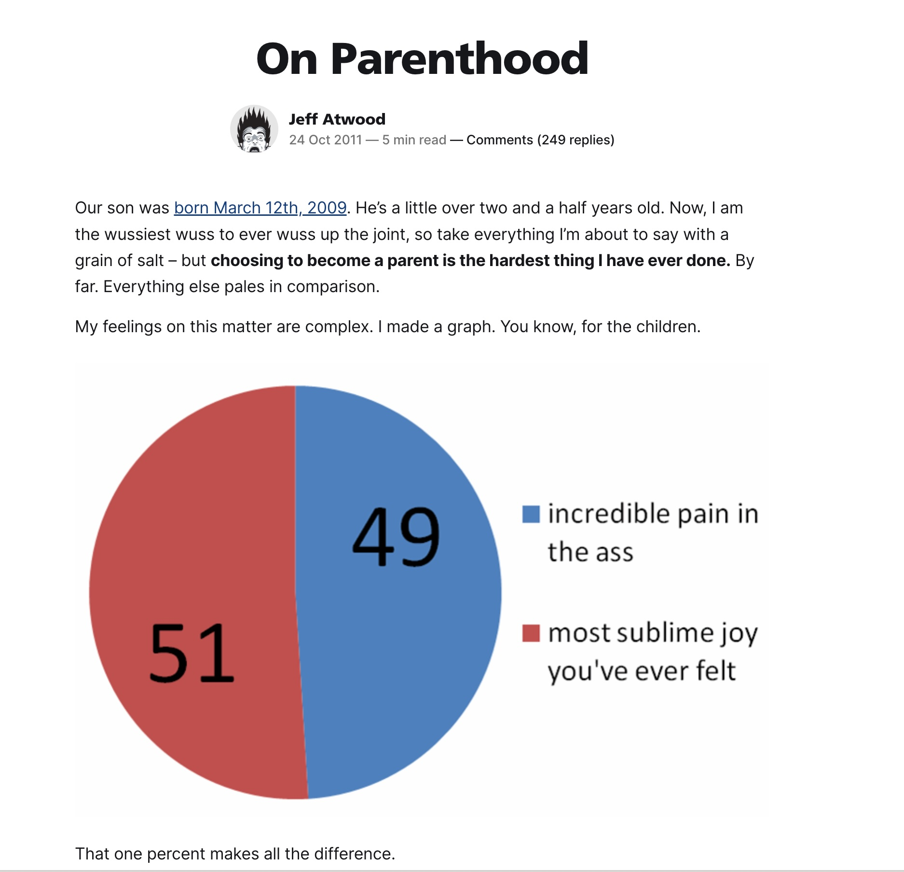

# How having kids made me a better engineer

Matt Merrill

---

# Because I'm a engineer that likes plain text ...

This deck is written in Markdown using [Marp](https://marp.app/)

Source available on Github.

---

<!-- _class: bottom-center -->
<!-- _color: white -->
You may remember be from #metal or being loud in slack.

---

# Before I start ...

No judgements here.

---

# I never thought I'd have kids...

---

# Then I did...

--- 

# Tiny people

--- 

# Big People

---

... And this is absolutely true

---

# So how'd it affect me as an engineer?

#1 - Perspective

---

# So what's all this about kids and work then?

Everything other than kids got easier

---

# So what's all this about kids and work then?

#2 - Perspective

---

This talk was inspired by a [blog post](https://code.theothermattm.com/having-kids-made-me-a-better-developer/) I wrote a while back.